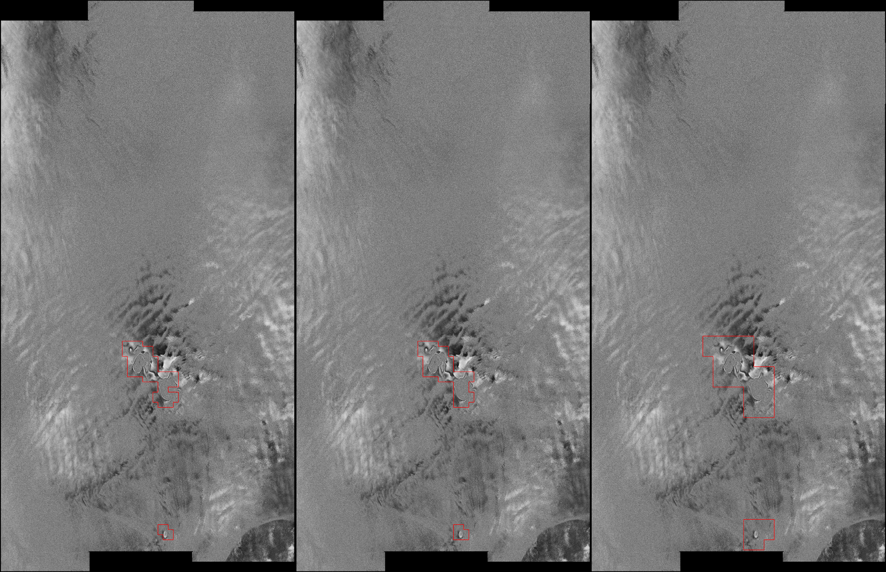

# SGL Detecting from DDInSAR Fringe Patterns with DINO

Automatic detection of subglacial hydrological activity (subglacial lakes, SGL) using vision transformer and linear classifier on Sentinel-1 double difference interferometric synthetic aperture radar (DDInSAR) phase images.

<div align="center">
  
</div>

### SGLNet Package and executable scripts for Python
**Main script for inference and prediction**
```
event_tracking_iff_DINO.py
```
**Script for ***experimental*** segmentation**
```
semantic_segmentation.py
```
**Scripts for training and validation**
```
image2trainset.py
train_classifier_head.py
test_network.py
```
**Scripts for testing against ground truth**
```
compute_classification_performance.py
compute_coherence.py
compute_lake_count.py
compute_segmentation_overlap.py
compute_segmentation_performance.py
```
